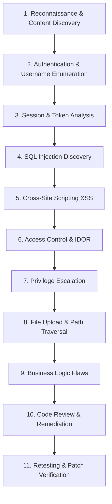

# CyberNex - Web Penetration Testing Lab

[](#)
[](#)

**CyberNex** is an intentionally vulnerable web application designed for ethical hacking, penetration testing practice, security code auditing, and remediation training.

Simulating a high-tech **Security Operations Center (SOC) & Threat Telemetry Platform**, CyberNex houses realistic security vulnerabilities in a clean, modern cybersecurity-themed user interface.

> ⚠️ **STRICT EDUCATIONAL DISCLAIMER**:
> This application is strictly an offline educational training lab. It is designed to run exclusively on `localhost` (`127.0.0.1`). It contains **NO malware**, **NO external network communication**, and **NO destructive functionality**. All credentials, API tokens, and user records are completely synthetic fake data.

---

## 🎯 Architecture & Pages

The application is built with a modern cybersecurity dark theme and contains three core operational pages plus learning utilities:

1. **Operator Authentication Gate (`/login`)**:
   - Modern SecOps login interface.
   - Houses SQL injection, username enumeration, session handling flaws, and open redirect parameters.
2. **Operations Command Dashboard (`/dashboard`)**:
   - Real-time threat metrics, active incident queue, system log telemetry, and threat lookup.
   - Houses Reflected XSS, Stored XSS, UNION-based SQL injection, and missing function authorization.
3. **Operator Account & Profile (`/profile`)**:
   - Operator credentials, dossier settings, API tokens, internal notes, and computational credits.
   - Houses IDOR, Mass Assignment privilege escalation, CSRF, unrestricted file upload, path traversal, and credit business logic flaws.
4. **Interactive In-App Lab Guide (`/lab-guide`)**:
   - Full in-app training syllabus with collapsible progressive hints and remediation code diffs.
5. **Passkey Recovery Gate (`/forgot-password`)**:
   - Password reset flow demonstrating token leakage and weak password policies.

---

## 🚀 Quickstart & Setup

### Prerequisites
- **Node.js**: v18+ (tested on Node v24)
- **npm**: v9+

### 1. Installation
Clone the repository and install dependencies:
```bash
git clone https://github.com/cybernexcore-lab/cybernex.git
cd cybernex
npm install
```

### 2. Initialize Database
Seed the local SQLite database (`database/cybernex.db`) with test accounts and incidents:
```bash
npm run reset-db
```

### 3. Start Local Server
Run the local Next.js development server:
```bash
npm run dev
```

The application will be accessible at:
👉 **`http://localhost:3000`** (or `http://127.0.0.1:3000`)

---

## 🔑 Default Test Accounts (Synthetic Data)

| Role | Username | Password | Clearance Level |
| :--- | :--- | :--- | :--- |
| **Administrator (CISO)** | `admin` | `AdminPassword2026!` | Tier 1 Administrator |
| **Senior SOC Analyst** | `alice` | `alice_hunter2` | Tier 2 Analyst |
| **Junior Operator** | `bob` | `bobpassword123` | Tier 3 User |

---

## 🛠️ Recommended Pentesting Workflow

Follow a standard black-box to white-box penetration testing lifecycle:



### Supported Testing Tools
The lab is fully compatible with standard security auditing tooling:
- **Burp Suite / OWASP ZAP**: Intercept and modify login requests, profile updates, and file uploads.
- **sqlmap**: Test SQL injection points on `/dashboard?q=` and `/api/user/lookup?id=`.
- **Gobuster / Feroxbuster / Dirb**: Directory and route discovery (`/robots.txt`, `/backup`, `/api/debug`).
- **Browser DevTools**: Test DOM sinks, inspect unescaped template tags, and modify cookie tokens.
- **curl / Postman**: Test REST API responses and header configurations.

---

## 📋 Vulnerability Checklist (`SECURITY_LAB.md`)

A comprehensive index mapping every vulnerability ID, affected endpoints, difficulty ratings, and remediation patches is maintained in **[`SECURITY_LAB.md`](./SECURITY_LAB.md)**.

Categories covered:
- **Authentication**: SQLi auth bypass (`CN-AUTH-01`), username enumeration (`CN-AUTH-02`), weak password recovery (`CN-AUTH-03`).
- **Session Management**: Tamperable base64 tokens (`CN-AUTH-04`), insecure GET logout (`CN-AUTH-05`).
- **Injection**: Search UNION SQLi (`CN-INJ-01`), numeric ID lookup SQLi (`CN-INJ-02`).
- **XSS**: Reflected XSS (`CN-XSS-01`), Stored XSS (`CN-XSS-02`), DOM XSS (`CN-XSS-03`).
- **Access Control**: IDOR dossier access (`CN-AC-01`), missing function authorization (`CN-AC-02`), mass assignment privilege escalation (`CN-AC-03`).
- **File Handling**: Unrestricted file upload (`CN-FILE-01`), path traversal (`CN-FILE-02`).
- **CSRF**: State-changing profile modification (`CN-CSRF-01`).
- **Security Configuration**: Sensitive debug information disclosure (`CN-SEC-01`), verbose database errors (`CN-SEC-02`).
- **Business Logic**: Negative credit reallocation flaw (`CN-MISC-02`), open redirect (`CN-MISC-01`).

---

## 🔄 Resetting the Lab Database

Whenever you test an exploit that modifies or corrupts database records, you can restore the pristine seed state instantly:

- **Via Terminal**:
  ```bash
  npm run reset-db
  ```
- **Via Web Interface**:
  Click the **"Reset Lab DB"** button located in the global footer on any page.

---

## 🛠️ Remediation & Patching Practice

Once you discover a vulnerability:
1. Locate the route handler in `src/app/api/...` or client page in `src/app/...`.
2. Inspect the vulnerable code and formulate a fix (e.g., parameterizing SQL queries, sanitizing HTML outputs, enforcing strict authorization checks).
3. Save your code changes; Next.js will hot-reload automatically.
4. Re-run your exploit via Burp Suite or browser to verify that the attack is mitigated.

---

## 📁 Repository Structure

```
cybernex/
├── database/
│   ├── schema.sql              # Initial SQLite database schema & seed data
│   ├── cybernex.db             # Runtime SQLite database (generated)
│   └── cybernex_backup.sql     # Target backup file for reconnaissance exercises
├── public/
│   ├── robots.txt              # Enumeration starting points
│   └── uploads/                # File upload destination folder
│       └── sample_threat_report.txt
├── scripts/
│   └── reset-db.js             # Database reset utility
├── src/
│   ├── app/
│   │   ├── api/                # Vulnerable API endpoints (auth, incidents, user, upload, download, debug)
│   │   ├── dashboard/          # Operations Command Dashboard
│   │   ├── forgot-password/    # Password recovery flow
│   │   ├── lab-guide/          # In-app pentest syllabus & progressive hints
│   │   ├── login/              # Operator Authentication Gate
│   │   ├── profile/            # Operator Credentials & Dossier Settings
│   │   ├── globals.css         # Cybersecurity dark theme styles
│   │   └── layout.tsx          # Root shell layout & DOM XSS hook
│   ├── components/             # Reusable UI components (Navbar, DomXssSink, ResetDbButton)
│   └── lib/
│       ├── auth.ts             # Session & token logic with educational flaws
│       └── db.ts               # better-sqlite3 database connection
├── package.json
├── tsconfig.json
├── README.md
└── SECURITY_LAB.md
```

---

## 🛡️ License & Ethical Usage
This software is provided exclusively for authorized educational training and security research. Only test systems you own or have explicit authorization to assess.
